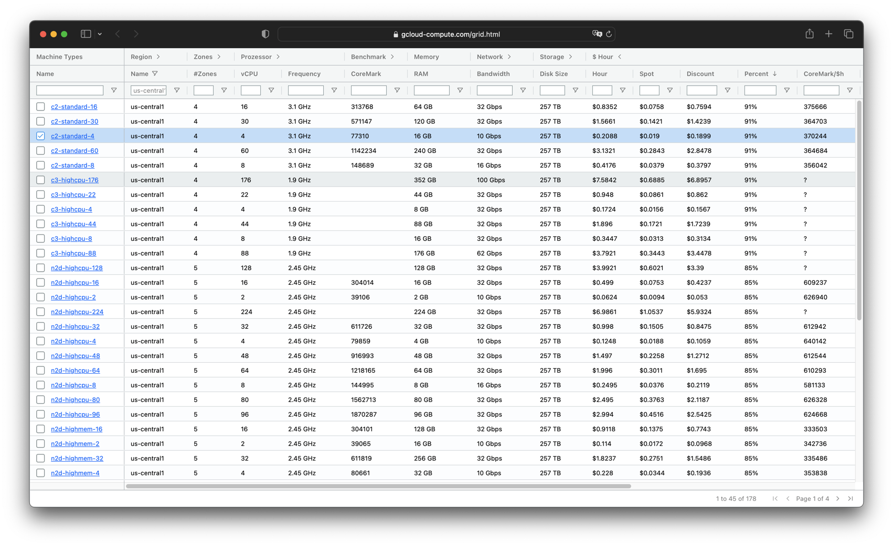
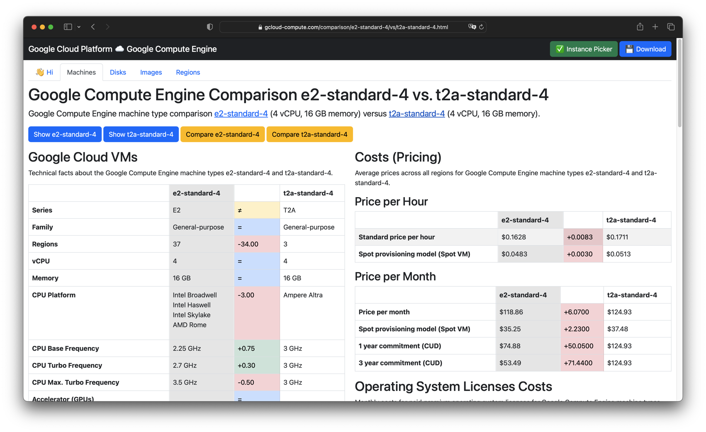

# Google Cloud Compute Comparison

This Google Compute Engine machine type comparison [webapp](https://gcloud-compute.com/) helps to find the optimal GCE machine type or instance in the many Google Cloud Platform (GCP) regions. A lot of information has been collected from various Google Cloud websites and different sources.

## Instance Picker

## Comparison

## 🖊️ Add, edit or change machine type information

The Google Compute Engine API is used to get all machine types in all regions and zones.
Additional information is read via SQL files during the build process.
Dive into the [build](./build/) folder to see how the data is retrieved, processed, and integrated.
Feel free to explore and contribute!

## ❤️ Contributing

Have a patch that will benefit this project?
Awesome! Follow these steps to have it accepted.

1. Please read [how to contribute](CONTRIBUTING.md).
1. Fork this Git repository and make your changes.
1. Create a Pull Request.
1. Incorporate review feedback to your changes.
1. Accepted!

## 📜 License

All files in this repository are under the [Apache License, Version 2.0](LICENSE) unless noted otherwise.

Portions of this webapp are modifications based on work created and shared by [Google](https://developers.google.com/readme/policies)
and used according to terms described in the [Creative Commons 4.0 Attribution License](https://creativecommons.org/licenses/by/4.0/).

Please note:

* No warranty
* No official Google product