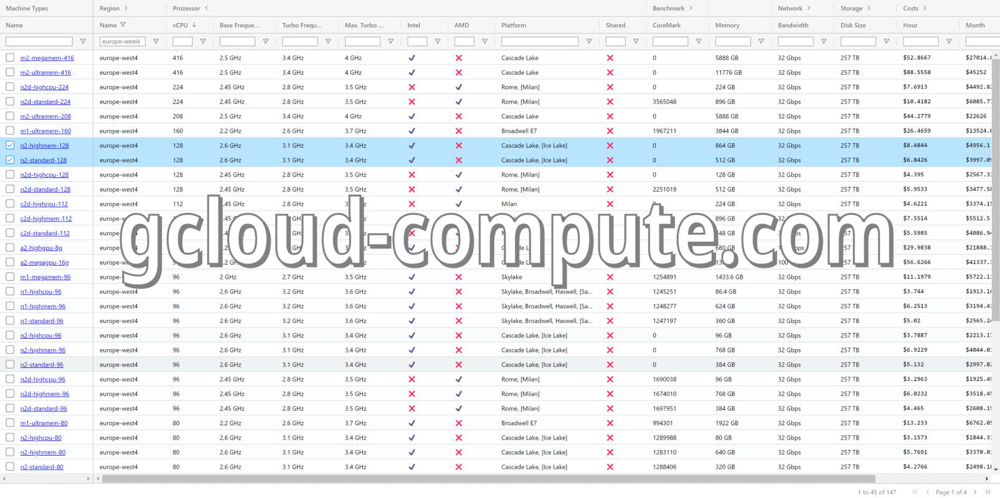

<div align="center">
<h1><a href="https://gcloud-compute.com/">gcloud-compute.com</a></h1>
</div>

This [webapp](https://gcloud-compute.com/) helps to find the optimal Google Compute Engine (GCE) machine type or instance in the many Google Cloud Platfrom (GCP) regions.
A lot of information has been collected from various Google Cloud websites and different sources.

[](https://gcloud-compute.com/)

## 🖊️ Add, edit or change machine type information

The Google Compute Engine API is used to get all machine types in all regions.
Additional information is read in via SQL files during the build process.
These files can be found in the [instances](./instances/) folder.

## 🧑‍💻 Development

If you want to customize the build process or run the webapp on your local computer,
you need the following requirements.

### Requirements

* Google Cloud SDK (`gcloud`)
* SQLite3 (`sqlite3`)
* Perl 5 (`perl`)
* Perl modules:
	* [App::Options](https://metacpan.org/pod/App::Options)
	* [YAML::XS](https://metacpan.org/pod/YAML::XS) (and `libyaml`)
	* [DBD::CSV](https://metacpan.org/pod/DBD::CSV)
	* [DBD::SQLite](https://metacpan.org/pod/DBD::SQLite)
	* [Template::Toolkit](https://metacpan.org/pod/Template::Toolkit)
	* [plackup](https://metacpan.org/dist/Plack/view/script/plackup)

Debian/Ubuntu:
```shell
sudo apt update
sudo apt install \
	apt-transport-https \
	ca-certificates \
	gnupg \
	sqlite3 \
	libapp-options-perl \
	libyaml-libyaml-perl \
	libdbd-csv-perl \
	libdbd-sqlite3-perl \
	libtemplate-perl \
	libplack-perl
```

» Install [Google Cloud SDK](https://cloud.google.com/sdk/docs/install#deb)

Build:
```shell
cd ../build/
bash build.sh
perl site.pl
cd ../
```

Run:
```shell
plackup
```

## ❤️ Contributing

Have a patch that will benefit this project?
Awesome! Follow these steps to have it accepted.

1. Please read [how to contribute](CONTRIBUTING.md).
1. Fork this Git repository and make your changes.
1. Create a Pull Request.
1. Incorporate review feedback to your changes.
1. Accepted!


## 📜 License

All files in this repository are under the [Apache License, Version 2.0](LICENSE) unless noted otherwise.

Please note:

* No warranty
* No official Google product